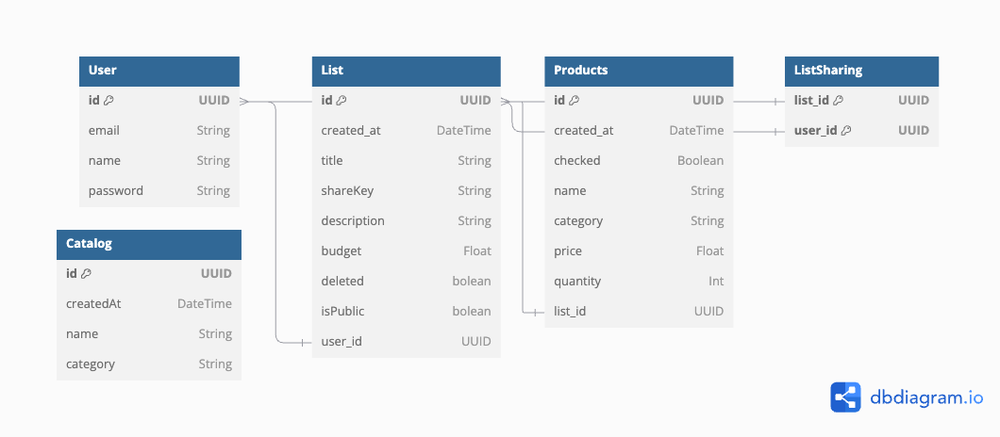

# Pango | Shopping List

# [Live Demo](https://pangolist.netlify.app/)

  <a href="#about-the-project">About the Project</a> •
  <a href="#tech-stack">Tech Stack</a> •
  <a href="#installation-and-local-run">Installation & Local Run</a> •
  <a href="#documentation">Documentation</a>

## About the Project

Pango is a shopping list application designed to simplify your shopping experience. With Pango, users can:

- Create, edit, and manage their shopping lists.
- Share lists with other users for collaborative shopping.
- Explore and view public lists shared by other users.

Whether you're planning your weekly groceries or organizing a group shopping trip, Pango helps you stay on track.

## Tech Stack

### Frontend

- **Design**: Built with [Mantine Dev](https://mantine.dev/) for a modern and accessible UI.
- **Framework**: React powers the frontend.
- **Development local Backend**: Used `json-server` for local development.
- **State Management**: Zustand handles global state management.
- **Routing**: React Router DOM for seamless route management.
- **Data Fetching**: React Query for caching and API interactions.

### Backend

- **API**: Built using Express and Prisma for robust data handling.
- **Database**: PostgreSQL powers the data layer.

### Deployment

- **Frontend**: Deployed on Netlify for fast and reliable delivery.
- **Backend**: Hosted on Vercel for scalable API management.

---

## UI/UX

### Create list and update list, set is public or private

- Users can create and update lists, set them as public or private.

### UI settings

 - Users can customize colors, list mode, show or hide the list info, and more.

### List manager and print list
- Users can manage lists, add, remove, and update items in their lists.

### List sharing
- Users can share lists with other users for collaborative shopping.

## Backend

- Users can create, update, and delete lists.

## Entities and relations

---

## Endpoints

### **Shopping Lists**
- **GET** `/lists`  
  Retrieves all shopping lists.

- **GET** `/lists/:id`  
  Retrieves a specific shopping list by its ID.

- **POST** `/lists`  
  Creates a new shopping list.

- **PUT** `/lists/:id`  
  Updates a specific shopping list by its ID.

- **DELETE** `/lists/:id`  
  Deletes a specific shopping list by its ID.

---

### **Products**
- **GET** `/lists/:listId/products`  
  Retrieves all products for a specific shopping list.

- **POST** `/lists/:listId/products`  
  Adds a new product to a specific shopping list.

- **PUT** `/lists/:listId/products/:productId`  
  Updates a product in a specific shopping list.

- **DELETE** `/lists/:listId/products/:productId`  
  Deletes a product from a specific shopping list.

---

### **Authentication and users**
- **POST** `/user`  
  Registers a new user.

- **POST** `/anonymous`  
  Creates an anonymous user.

- **POST** `/authenticate`  
  Logs in an existing user.

- **POST** `//verify-token`  
  Verifies the authentication token.

---

### **Sharing**
- **POST** `/lists/:listId/share`  
  Shares a shopping list with another user.

- **DELETE** `/lists/:listId/share/:userId`  
  Removes a shared user from a shopping list.

